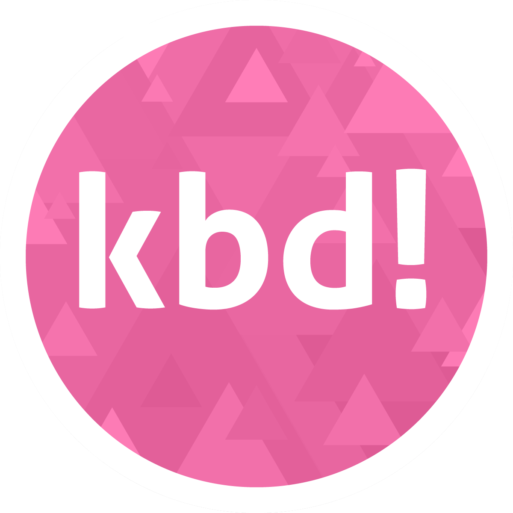

  

# kbd!

A rhythm game that builds on keyboards, and only keyboards. Check out the [demo video](https://www.bilibili.com/video/BV14U4y1C7nW/)!

Some of the current resources come from modifications of items in [osu-resources](https://github.com/ppy/osu-resources), following the CC-BY-NC 4.0 license.

**The project is in early development, and has absolutely no warranties.**

## Requirements

You have to get a keyboard with iCUE RGB support, either built-in laptop keyboards (e.g. Legion R9000K) or external keyboards (e.g. K70).

You are welcome to contribute if you have a RGB keyboard that can be programmed in some other ways!

Currently only Windows 7+ is supported.

## Running the game

1. Download and unzip or `git clone` this repository.
2. Install Python 3.8+ in your system.
3. Run `pip install -r requirements.txt` from your command line.
4. Install and run [iCUE 4](https://www.corsair.com/us/en/downloads).
5. Run `python gayme.py`.

## Game instructions
1. Press any key in the title scene to start game play.
2. **Turn on `Num Lock`.**
3. Hit the white-lit key when the colored rays reach it from sides.
4. If you are doing well, you will see a burst of a rainbow colors around the device. The indicators around the keyboard will become green if you hit a bit off-time. They will become red if you missed a key.
5. Your performance will be shown by colors after you finish a song. Press `Esc` at this time to exit.
6. You may want to open `dustbin.txt` to prevent your keyboard hits to pass onto other applications (better event handling under development).

## Files
- `audio`: audio used by the game.
- `charts`: charts and tracks in the game. Currently only one is provided, the welcome chart.
- `common.py`: utility code for timing and blending colors.
- `gayme.py`: the main game entry point.
- `icue.py`: utility for communicating with iCUE keyboards. **Update: Now it employs gamma correction to make displayed colors more accurate.**
- `keys.py` and `vkey.py`: defines constants for iCUE LEDs and keys on keyboards.
- `play.py`: the gameplay logic.
- `sounds.py`: defines the sounds in the game (not including the music).

## Charting and development
Details coming soon...

You may check `charts/welcome_chart.py` for an example of a chart. The definitions shall be straightforward to understand. Change `gayme.py` line 97 to play a different chart. Track selection is under development.

Check `common.py` and `icue.py` if you want to develop other games/applications on keyboard RGBs.

The game is framed under `asyncio` event loops.
